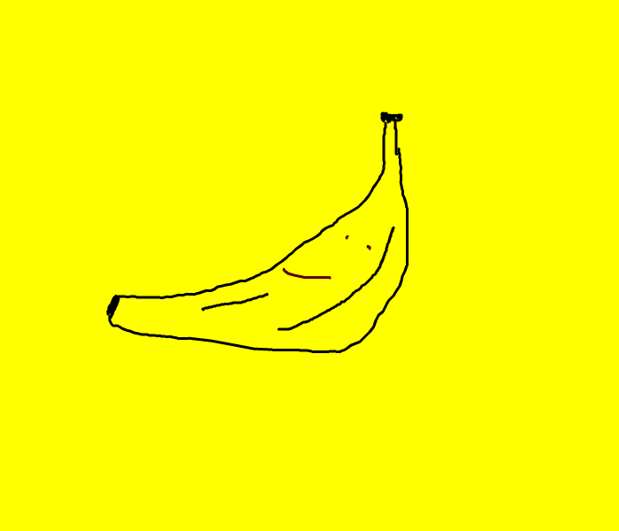

# Bored Banana
*Too many bananas are bored of going brown in the fruitbowl. Don't leave your yellow buds behind, get that potassium in ya!*

Bored Banana is a food expiration app to help cut down food wastage.
This was the first project I made at Dev Academy, and it was built as a prototype to time the usability of all kinds of foods. I chose bananas because they're yummy, fun to draw and amongst some of the most frequently wasted foods in New Zealand household.

Here's how it works:

1. Buy some bananas
2. Enter their details; quantity, date bought and total cost
3. Add your bananas to the database by clicking the 'add banana data' button
4. See all your previously bought bananas by clicking the 'show me my bananas' button
5. Click 'check freshness' to start the expiration timer and start planning all your delicious banana bread recipes :P

